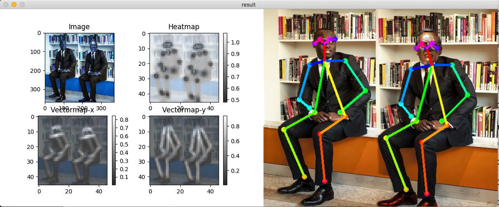

# Human Pose Recognition and Tracking

This is a TensorFlow-based human pose recognition project that integrates YOLOv3, Deep SORT, and tf-pose-estimation to perform human detection, pose estimation, and object tracking on images, videos, and live camera feeds.

## Key Features

- Human keypoint and skeletal pose estimation
- YOLOv3 human object detection
- Deep SORT multi-object tracking
- Support for image, video, and real-time camera inputs
- Tkinter-based desktop interface and ROS-related examples


###   方法概览

1. 从图像中提取人体关键点，并将第 $k$ 个关键点表示为
   $p_k=(x_k,y_k)$。
2. 按人体区域将关键点划分为 9 个集合：全身躯干、上半身、下半身、左右手臂、
   左右腿以及左右大腿。
3. 对每个集合提取几何统计特征。论文采用 Graham Scan 计算凸包，并在凸包上
   寻找距离最远的两个关键点；也可使用最小外接矩形的旋转角度作为特征。
4. 使用最远点连线与水平方向夹角的正切值
   $\tan\alpha_n=(y_i-y_j)/(x_i-x_j)$，结合分层规则依次判断肢体与躯干姿态。

```text
人体图像 → 关键点提取 → 关键点集合划分 → 几何统计特征 → 分层语义判断
```

论文给出的分层规则首先判断抬臂和踢腿，再判断弯腰、站立、蹲坐与平躺；这种
集合化处理使方法在部分关键点不可见时仍可利用其余关键点完成判断。

### Result

| 数据集 | 场景与样本 | 评价指标 | 论文报告结果 |
| --- | --- | --- | ---: |
| IFD | 直立、蹲坐；300 张图像 | Accuracy | 90.8% |
| MPII | 多人及复杂姿态；200 张图像 | Accuracy | 77.2% |
| PASCAL VOC 2010 | 复杂背景；250 张图像 | Average Accuracy | 77.1% |

以上数值来自论文中的实验，不代表本仓库在当前软硬件环境下已经完成同样的复现。


## Runtime Environment

This project is an archived project developed using earlier versions of Python and TensorFlow. The original development environment utilized Python 3.6; please refer to `requirements.txt` for the list of dependencies. Depending on the specific entry point used, additional installations of TensorFlow, OpenCV, Pillow, PyAudio, and Tkinter may also be required.

```bash
python -m venv .venv
.venv\Scripts\activate
pip install -r requirements.txt
```

编译姿态估计后处理扩展的方法，以及模型下载说明，请参阅下方保留的
tf-pose-estimation 文档。项目中的大型 YOLO/CMU 模型权重不会提交到 GitHub，
请按模型目录中的下载脚本或你自己的模型来源放置权重文件。

## Quick start

```bash
# 单张图片姿态估计
python run.py --model=mobilenet_thin --resize=432x368 --image=./images/p1.jpg

# 摄像头姿态估计
python run_webcam.py --model=mobilenet_thin --resize=432x368 --camera=0

# 桌面界面
python 界面.py
```

## 项目来源与许可

本项目在 [tf-pose-estimation](https://github.com/ildoonet/tf-pose-estimation)
基础上进行功能扩展，并集成了 YOLOv3 与 Deep SORT 相关代码。代码按仓库中的
[Apache License 2.0](LICENSE) 发布；使用第三方模型或数据时，请同时遵守其各自许可。

---

## tf-pose-estimation 原始说明

'Openpose', human pose estimation algorithm, have been implemented using Tensorflow. It also provides several variants that have some changes to the network structure for **real-time processing on the CPU or low-power embedded devices.**

**You can even run this on your macbook with a descent FPS!**

Original Repo(Caffe) : https://github.com/CMU-Perceptual-Computing-Lab/openpose

| CMU's Original Model</br> on Macbook Pro 15" | Mobilenet-thin </br>on Macbook Pro 15" | Mobilenet-thin</br>on Jetson TX2 |
|:---------|:--------------------|:----------------|
|      |  |  |
| **~0.6 FPS** | **~4.2 FPS** @ 368x368 | **~10 FPS** @ 368x368 |
| 2.8GHz Quad-core i7 | 2.8GHz Quad-core i7 | Jetson TX2 Embedded Board | 

Implemented features are listed here : [features](./etcs/feature.md)

## Important Updates

- 2019.3.12 Add new models using mobilenet-v2 architecture. See : [experiments.md](./etcs/experiments.md)
- 2018.5.21 Post-processing part is implemented in c++. It is required compiling the part. See: https://github.com/ildoonet/tf-pose-estimation/tree/master/src/pafprocess
- 2018.2.7 Arguments in run.py script changed. Support dynamic input size.

## Install

### Dependencies

You need dependencies below.

- python3
- tensorflow 1.4.1+
- opencv3, protobuf, python3-tk
- slidingwindow
  - https://github.com/adamrehn/slidingwindow
  - I copied from the above git repo to modify few things.

### Install

Clone the repo and install 3rd-party libraries.

```bash
$ git clone https://www.github.com/ildoonet/tf-pose-estimation
$ cd tf-pose-estimation
$ pip3 install -r requirements.txt
```

Build c++ library for post processing. See : https://github.com/ildoonet/tf-pose-estimation/tree/master/tf_pose/pafprocess
```
$ cd tf_pose/pafprocess
$ swig -python -c++ pafprocess.i && python3 setup.py build_ext --inplace
```

### Package Install

Alternatively, you can install this repo as a shared package using pip.

```bash
$ git clone https://www.github.com/ildoonet/tf-pose-estimation
$ cd tf-openpose
$ python setup.py install  # Or, `pip install -e .`
```

## Models & Performances

See [experiments.md](./etc/experiments.md)

### Download Tensorflow Graph File(pb file)

Before running demo, you should download graph files. You can deploy this graph on your mobile or other platforms.

- cmu (trained in 656x368)
- mobilenet_thin (trained in 432x368)
- mobilenet_v2_large (trained in 432x368)
- mobilenet_v2_small (trained in 432x368)

CMU's model graphs are too large for git, so I uploaded them on an external cloud. You should download them if you want to use cmu's original model. Download scripts are provided in the model folder.

```
$ cd models/graph/cmu
$ bash download.sh
```

## Demo

### Test Inference

You can test the inference feature with a single image.

```
$ python run.py --model=mobilenet_thin --resize=432x368 --image=./images/p1.jpg
```

The image flag MUST be relative to the src folder with no "~", i.e:
```
--image ../../Desktop
```

Then you will see the screen as below with pafmap, heatmap, result and etc.



### Realtime Webcam

```
$ python run_webcam.py --model=mobilenet_thin --resize=432x368 --camera=0
```

Then you will see the realtime webcam screen with estimated poses as below. This [Realtime Result](./etcs/openpose_macbook13_mobilenet2.gif) was recored on macbook pro 13" with 3.1Ghz Dual-Core CPU.

## Python Usage

This pose estimator provides simple python classes that you can use in your applications.

See [run.py](run.py) or [run_webcam.py](run_webcam.py) as references.

```python
e = TfPoseEstimator(get_graph_path(args.model), target_size=(w, h))
humans = e.inference(image)
image = TfPoseEstimator.draw_humans(image, humans, imgcopy=False)
```

If you installed it as a package,

```python
import tf_pose
coco_style = tf_pose.infer(image_path)
```

## ROS Support

See : [etcs/ros.md](./etcs/ros.md)

## Training

See : [etcs/training.md](./etcs/training.md)

## References

See : [etcs/reference.md](./etcs/reference.md)
